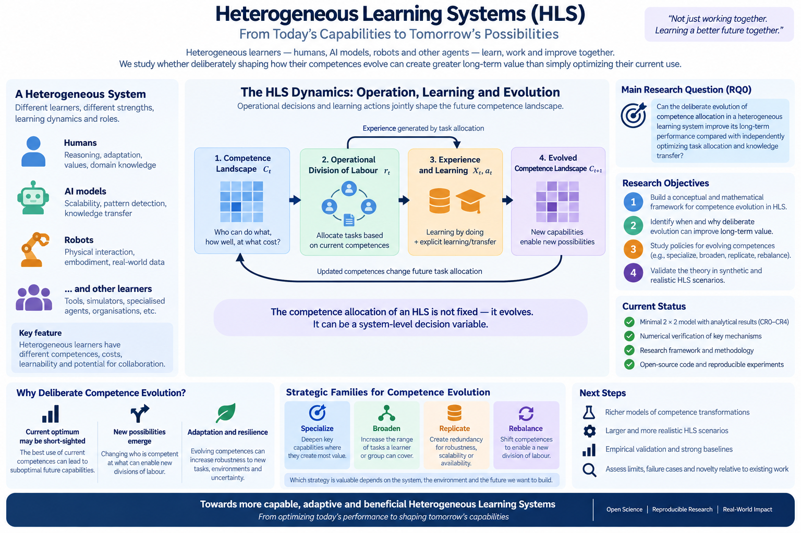

# Heterogeneous Learning Systems

Dynamic task allocation, selective learning, and deliberate evolution of competence in heterogeneous model portfolios.



*This figure is a conceptual snapshot of the current research programme, not a claim of novelty or a finalized architecture.*

This repository is a research programme about HLS as an evolving distribution of competences, not only a heterogeneous portfolio to be exploited. It contains no validated deployed algorithm, empirical evidence, or established novelty claim. Its minimal-model identities and microverifications are explicitly model-scoped consistency and falsification evidence, not general HLS results.

## 1. Research motivation

The broad motivating question is:

> “How should a heterogeneous system dynamically allocate tasks among models/agents while simultaneously deciding how to redistribute the knowledge generated by those executions so that the system deliberately evolves its division of competences?”

The programme studies systems composed of models or agents with different capabilities, costs, latencies, specialization, learnability/plasticity, and possible roles as learners, specialists, generalists, or teachers. Its core feedback loop is:

```text
routing
    -> operational experience
    -> learning / knowledge transfer
    -> competence change
    -> future routing
```

This is neither merely a routing problem nor merely a knowledge-transfer problem: operational decisions can determine who gains relevant experience, while learning and transfer can change the portfolio's future effective competences. The programme therefore asks whether deliberately shaping who will be competent at what can create greater long-term system value than simply optimizing current use and local improvement.

## 2. Working system abstraction

A provisional competence landscape is:

```text
C_t = [c_iz(t)]
```

where `c_iz(t)` denotes the effective competence of model/agent `i` on task region or task family `z` at time `t`. Competence may not be directly observable. This matrix is a conceptual abstraction, not an established sufficient state representation.

The programme distinguishes two coupled decision layers.

### Operational decision

Which model or agent should solve the current task?

### Competence-improvement decision

Should knowledge generated by the execution be used to modify one or more agents? If so, what competence should be improved, which recipient should learn it, at what cost, and with what expected future system value?

## 3. Official research question

The current repository-level research question is RQ0:

> Can the deliberate evolution of competence allocation in a heterogeneous learning system improve its long-term performance compared with independently optimizing task allocation and knowledge transfer?

RQ0 is a **HYPOTHESIS**. The terms “competence allocation,” “deliberate evolution,” “long-term performance,” and the comparison class require problem-specific operational definitions only after the literature landscape is audited. RQ0 remains the sole promoted repository research question; narrower hypotheses support incremental theoretical and empirical progress.

## 4. First diagnostic branch: H1 and RouteNLP

> **WORKING HYPOTHESIS — falsifiable, not yet an official RQ, not established.**
>
> “Failure frequency and quality gap are insufficient statistics for selecting competence-improvement actions in a heterogeneous model portfolio. A useful selection policy should account for the expected learnability of the recipient model and the downstream operational value created by the competence change.”

### RouteNLP

RouteNLP is the strongest direct operational precedent for this historical diagnostic branch and a useful direct adversary for H1. Its targeted-distillation heuristic ranks failure clusters approximately as:

```text
S_RouteNLP(z) = N_z * mean(Delta q_z)
```

where `N_z` is the frequency/size of failure cluster `z`, and `Delta q_z` is its average quality gap.

RouteNLP already establishes that routing failures can be exploited to select distillation data; cheaper models can be improved; the router can then be retrained or recalibrated; and this can reduce future operating cost. Therefore, closed-loop routing plus learning must not be claimed as novel.

The narrower unresolved question is: is `frequency * quality_gap` sufficient for deciding which competence-improvement action is worth performing?

The current conceptual decomposition is:

```text
V(i,z)
    ~ N_z
      * P_learn(i,z)
      * V_downstream(i,z)
      - C_learn(i,z)
```

Here, `P_learn(i,z)` is the expected learnability of competence `z` by recipient `i`; `C_learn(i,z)` is the cost of producing the competence change; and `V_downstream(i,z)` is the future value created for the whole heterogeneous system.

> **Conceptual only.** This decomposition exposes potentially missing variables. It is not a proposed final algorithm, theorem, or established optimal value function.

For the historical development and the M0/M0.1 diagnostic analysis, see the [chronology](docs/research_origin_and_chronology.md), [landscape](docs/landscape/), and [model notes](docs/models/). These materials constrain the programme but do not define its centre.

## 5. Current status

The broad programme remains open. Its general framing is an HLS as an evolving distribution of competences: operation gives the current distribution value, while experience, learning, and transfer may change a future division of labour. H1 and RouteNLP remain useful subordinate diagnostic material, not the programme's centre.

Checkpoint 004 is the current programme-level position. Future work must test the general hypothesis through physically meaningful competence transformations, collective operational value, null cases, and fair frozen, reactive, local, and fully informed modular adversaries. It must not simply expand a convenient lateral mechanism. See the [general research model](docs/general_research_model.md) and [Checkpoint 004](docs/research_program_checkpoint_004.md).

## 6. Repository map

- [Research Programme Checkpoint 001](docs/research_program_checkpoint_001.md)
- [Research Programme Checkpoint 002](docs/research_program_checkpoint_002.md)
- [Research Programme Checkpoint 003 — historical post-K0](docs/research_program_checkpoint_003.md)
- [Research Programme Checkpoint 004 — current position](docs/research_program_checkpoint_004.md)
- [Research origin and chronology](docs/research_origin_and_chronology.md)
- [General research model](docs/general_research_model.md)
- [Cross-domain mathematical strategy](docs/research_strategy_cross_domain_toolkit.md)
- [Research questions](docs/research_questions.md)
- [Research log](docs/research_log.md)
- [Handover](docs/HANDOVER.md)
- [M0 minimal competence-intervention model](docs/models/model_M0.md)
- [Minimal competence-evolution theory](docs/theory_competence_evolution_minimal_model.md)
- [Theory paper skeleton](paper/)
- [Initial and consolidated landscape](docs/landscape/)
- [Literature map](docs/literature/)

`adaptive_routing` is an independent prior project, not this repository's history or implementation base. See [projects/README.md](projects/README.md).
