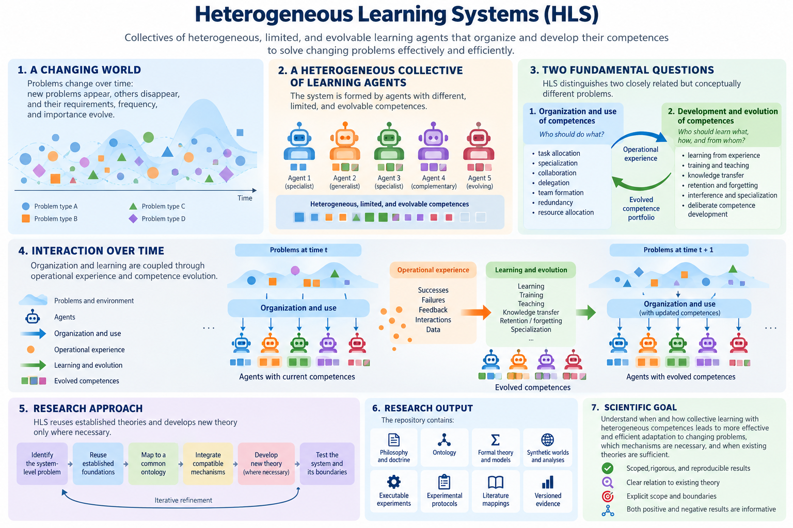

# Heterogeneous Learning Systems

**Heterogeneous Learning Systems (HLS)** studies how a collective of
heterogeneous, limited, and evolvable learning agents can organize and develop
its competences to solve changing problems effectively and efficiently.

The starting point is simple: problems change. New problems appear, others
disappear, and their requirements, frequency, and importance evolve. No single
agent needs to possess all the competences required by the system.

The fundamental object of study is therefore not an isolated learning model,
but a **system of agents with heterogeneous competences whose organization,
use, and development can change over time**.

<p align="center">
  
</p>

## Two fundamental questions

HLS distinguishes two closely related but conceptually different problems:

### 1. Organization and use of competences

> **Who should do what?**

Given the competences currently available in the system, how should agents be
organized and used to solve the problems that arise?

This includes mechanisms such as task allocation, specialization,
collaboration, delegation, escalation, team formation, redundancy, and
resource allocation.

### 2. Development and evolution of competences

> **Who should learn what, how, and from whom?**

How should the competence portfolio of the system evolve as problems and needs
change?

This includes learning from experience, training, teaching, knowledge
transfer, retention, forgetting, interference, specialization, and deliberate
competence development.

These two questions are distinct, but they need not be independent:

```text
organization / use
        |
        v
 operational experience
        |
        v
learning / competence evolution
        |
        v
 future competence portfolio
        |
        v
 future organization / use
```

Understanding when this interaction matters, when it can be separated, and
when existing theories are sufficient to manage it is a central scientific
challenge of the programme.

## Research approach

HLS is not intended to replace established theories of learning, allocation,
control, organization, or decision making.

The programme instead seeks to:

```text
identify the system-level problem
        ->
reuse the strongest established foundations
        ->
map them into a common ontology
        ->
integrate compatible mechanisms
        ->
develop new theory only where necessary
        ->
test the resulting system and its boundaries
```

Novelty is therefore sought at the level where it actually occurs: the system,
its organization, the interaction among its components, or the consequences
of treating heterogeneous and evolving competences collectively.

Existing theory is a foundation, not an obstacle.

## Scientific scope

The repository contains:

- programme-level philosophy and research doctrine;
- a common HLS ontology;
- formal and model-scoped theory;
- synthetic worlds and exact analyses;
- executable experiments and tests;
- frozen experimental protocols;
- literature mappings;
- and versioned scientific evidence.

Results have explicit scope.

A theorem proved for a particular model is not automatically a general HLS
property. A synthetic existence result does not establish prevalence or
real-world relevance. A pilot experiment is not automatically evidence for the
programme's main research question.

Negative results, equality conditions, reductions to established theory, and
cases in which simpler modular approaches are sufficient are part of the
scientific output.

## Start here

For the conceptual foundations:

1. [HLS Philosophy](docs/HLS_PHILOSOPHY.md) — **what HLS is, why it matters,
   and what it is for**.
2. [Research Doctrine](RESEARCH_DOCTRINE.md) — **how the research programme is
   conducted and kept scientifically disciplined**.
3. [HLS Ontology](docs/hls_ontology.md) — **the common semantic language used
   to represent HLS phenomena and integrate theories consistently**.

For the current research:

4. [Research Questions](docs/research_questions.md) — the questions currently
   under investigation.
5. [HLS Current State](docs/HLS_CURRENT_STATE.md) — what is currently
   established, what has been ruled out, and what remains open.

For technical depth:

- [Theory Registry](docs/theory/README.md) — formal results and scoped models;
- [Experimental Documentation Registry](docs/experiments/README.md) — worlds,
  protocols, runners, and evidence;
- [Theoretical Foundations](docs/theoretical_foundations_cross_domain.md) —
  established theories and their relationship to HLS;
- [Literature Collection](docs/literature/README.md) — source and literature
  policy;
- [Scientific History](docs/HISTORY.md) — the compact scientific path to the
  present state.

## Repository structure

```text
README.md
RESEARCH_DOCTRINE.md

docs/
├── HLS_PHILOSOPHY.md
├── hls_ontology.md
├── research_questions.md
├── HLS_CURRENT_STATE.md
├── HISTORY.md
├── theoretical_foundations_cross_domain.md
├── theory/
├── experiments/
├── experimental_foundations/
├── models/
└── literature/

experiments/
results/
src/
tests/
projects/
```

The documentation is deliberately layered:

```text
PHILOSOPHY
    what / why / what for
        |
        v
DOCTRINE
    how research is conducted
        |
        v
ONTOLOGY
    common semantic language
        |
        v
RESEARCH QUESTIONS
    what is currently being investigated
        |
        v
THEORY + EXPERIMENTS + EVIDENCE
```

`HLS_CURRENT_STATE.md` is the single canonical summary of the programme's
present scientific state.

## Project boundary

[`adaptive_routing`](https://github.com/franjgs/adaptive_routing) is an
independent prior project. It is **not** the origin, history, or implementation
base of HLS.

Its relationship to this programme is recorded only as external prior work in
[projects/README.md](projects/README.md).